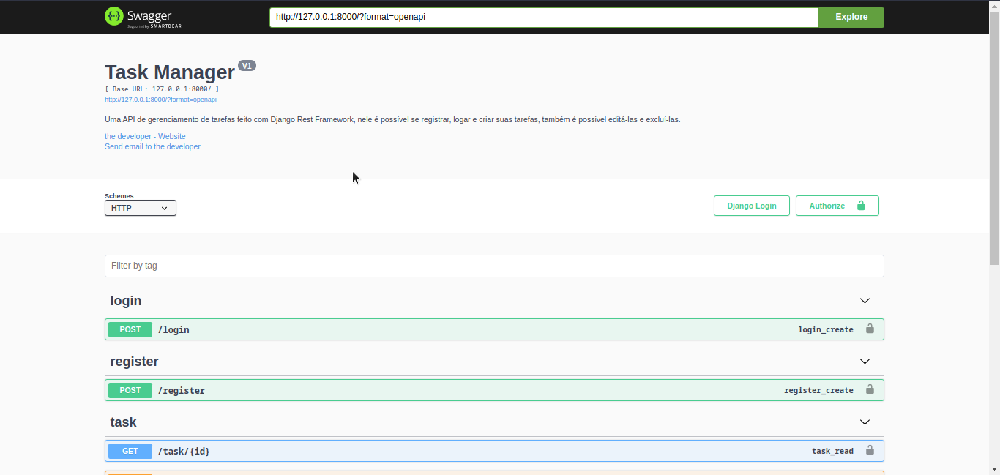

# Task Manager

 Uma API para gerenciamento de tarefas, nela é possível se registrar, logar e criar suas tarefas, também é possível visualizar, editar e excluir tarefas individualmente.

 A principal motivação desse repositório é aprender mais sobre o Django e o DRF (Django REST Framework), e também aprender e aplicar conceitos de hash de senha com bcrypt, autenticação com JWT e níveis de permissões de usuários.

### Tabela de Conteúdos

* [Funcionalidades](#funcionalidades)
* [O que eu aprendi com esse projeto](#o-que-eu-aprendi-com-esse-projeto)
* [API documentada com Swagger](#api-documentada-com-swagger)
* [Como executar o projeto](#como-executar-o-projeto)

### Funcionalidades

- [X] Cadastro de contas de usuários
- [X] Hashing de senha com bcrypt
- [X] Autenticação/Login com Token JWT
- [X] Permissões de usuário
- [X] Usuário pode criar tarefas
- [X] Usuário pode editar/excluir uma tarefa

### O que eu aprendi com esse projeto

- Criar sistema de login com autenticação via JWT
- Armazenamento de senhas com hash bcrypt
- Permissões de usuários da aplicação
- Documentação da API com Swagger
- Criar rotas e views/serializers mais detalhados

### API documentada com Swagger

### Como executar o projeto

- Ative a venv com "source ./venv/bin/activate" se estiver no Linux, caso seja Windows o comando é "./venv/scripts/activate".
- Para instalar as libs necessárias use o comando "pip install -r requirements.txt"
- Rode as migrations com o comando "python manage.py migrate"
- Crie um arquivo .env com "JWT_SECRET_KEY=< chave da sua escolha >"
- Rode o servidor com o comando "python3 manage.py runserver"
